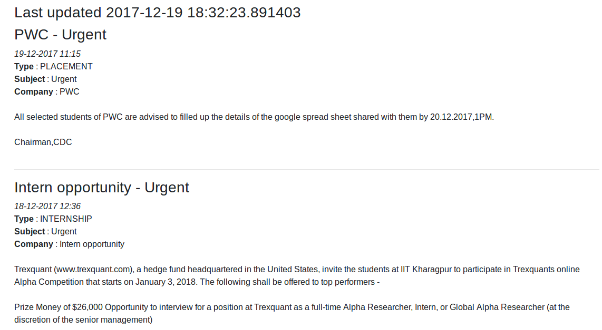
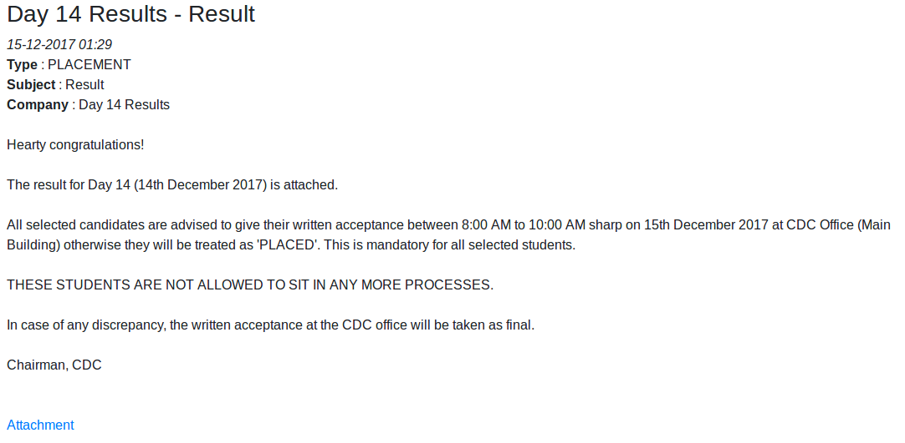

# mftp - self sufficient

> Get emails when T&P stuff changes on IIT KGP's ERP.



_Top part of the page_



_Attachment URLs are given at the end of the notice_

## Setup

Tested only on Ubuntu 16.04 LTS. Should work on machines with Python 2
installed.

1. Setup a cron job

```sh
* * * * * cd path-to-clone && python update.py
```

2. Start a HTTP server at the path where you cloned this file

```sh
python -m SimpleHTTPServer 4000
```

This will start a server at `http://localhost:4000`. This is the easiest way to
start a server, you can use something more complex, or some other language.

**Note:** This might be insecure if you don't have
[`ufw`](https://wiki.ubuntu.com/UncomplicatedFirewall) on your computer. If you
want to stay secure, activate ufw and configure it to ensure that all ports are
closed on your computer.

3. Open the server page in your browser window

**Tip:** You can pin the tab. It will auto-refresh every 50 seconds. The data is
fetched every minute. The last updated time is shown at the top of the screen.

## License

GPLv3. Issues and pull requests are welcome.
